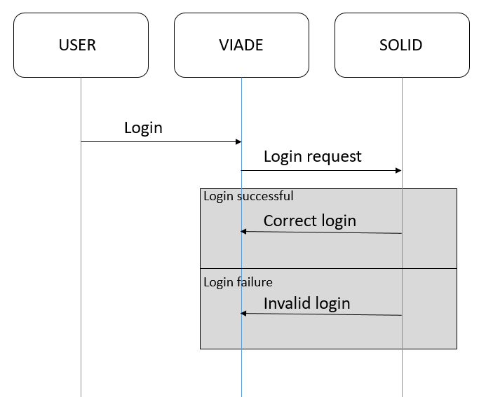
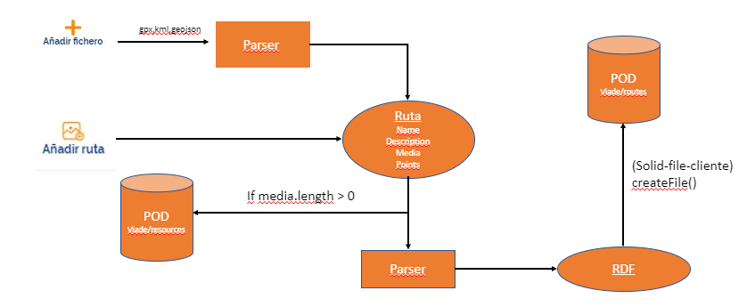
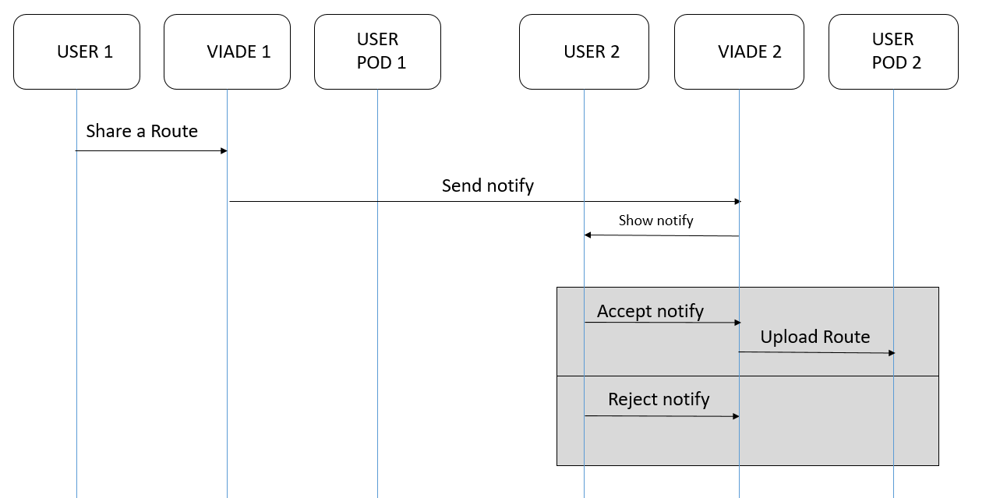

[[section-runtime-view]]
== Runtime View
=== Log in

* Shows the login of the application and how the whole process works.

* A user enters their credentials in the login interface. That interface then sends the request to the authenticator, which in turn validates the data on the SOLID server. From here, two situations can occur:

** The first is that the session is correct, which redirects you to the main page of the application.

** The second option is that the login is invalid, which shows you the error message.

=== Create a new route

* Shows how a route is created in the application.

* The user wants to create a route. In the navigation bar there is an option to create a route. The user must indicate the name and mark on a map the points that will make up the route apart from optional data such as the description. Once the necessary data has been added, the create button will be pressed to verify that it has valid data and the route will be uploaded to the POD. From here, two situations can occur:

** That the route has been saved successfully and you receive a message that it was saved successfully.

** Or that the path could not be saved and you received an error message.

=== Share a route

* Shows how a route is shared in the app.

* The user wants to share an existing route on their POD. For this you must select the route which you want to share and with whom you want to share it. Once everything is selected, a notification will be sent to the user with whom you want to share it. From here, two situations can occur:

** The user accepts the notification, which will cause the shared route to be uploaded to their POD.

** Or that you don't want to accept the shared route.

