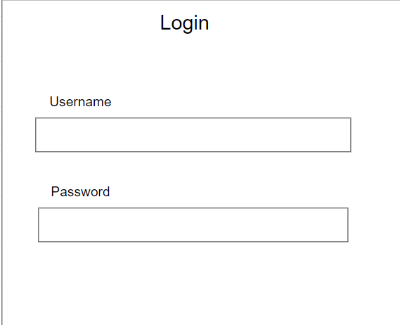

[[section-deployment-view]]
== Deployment View
=== Login
This represents the view where the user will have to login himself to access to his pod.

=== Route Creation
This image is the main view of the app here you will be able to save a point to make a route.
That point will be saved and linked to the previous and next one to make the route
This will save the route when you click on finished. 

image:routeCreation.png["Route Creation"]

=== Route Visualization
In this part of the aplication you can see your own routes or the routes that your friend share to you, to follow it.

image:routesVisual.png["Route Visualization"]

=== File Sharing
This part of the application makes you able to share all photos, videos or routes that you have in your pod to a selected friend.

image:fileSharing.png["File Sharing"]

=== Routes Sharing
The deployment view is very easy to describe in a decentralized chat because we are just focusing in the interaction between the users and SOLID providers

image:routeSharing.PNG["Route Sharing"]

=== Add Friend

In this part of the application you can add as a friend another user registered in the application indicating his name.

image:addFriend.PNG["Add Friend"]

