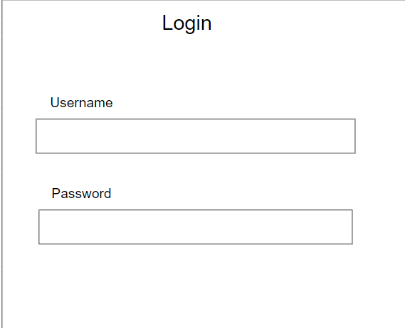
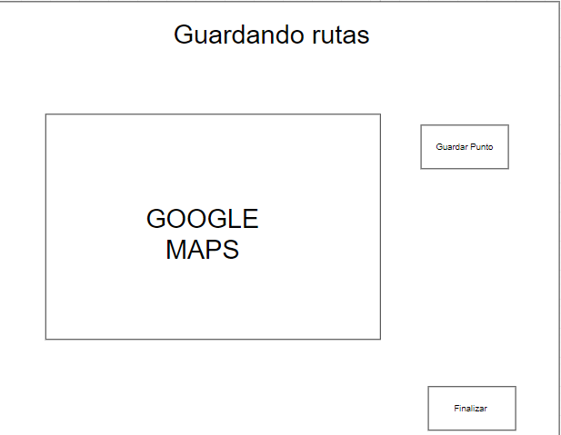

[[section-deployment-view]]

== Deployment View

This represents the view where the user will have to login himself to access to his pod.

This image is the main view of the app here you will be able to save a point to make a route.
This will save the route when you click on finished.