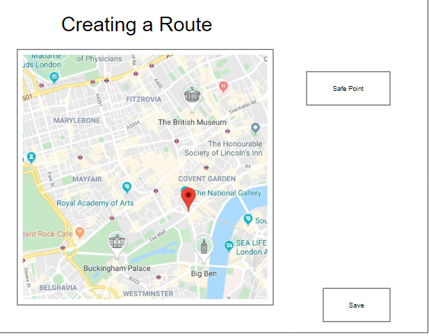
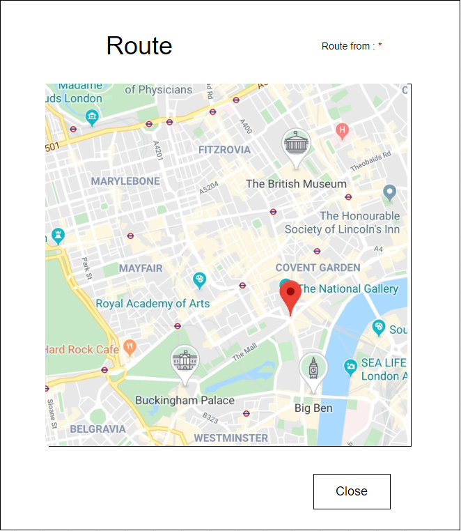
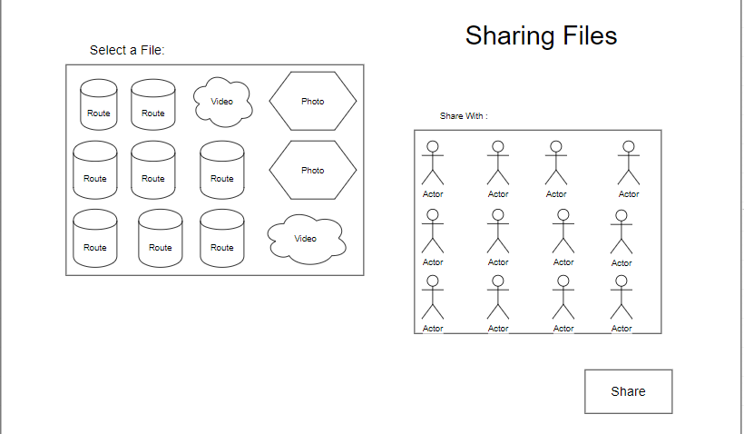
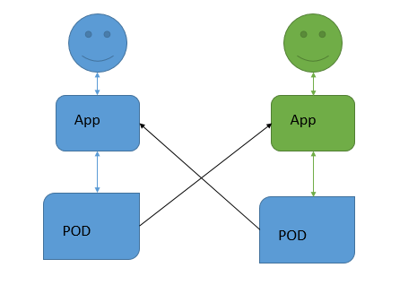
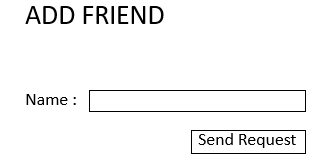

[[section-deployment-view]]

== Deployment View
[role="arc42help"]
****
****
=== Login
This represents the view where the user will have to login himself to access to his pod.

image::images/login.png[Login]

****
[role="arc42help"]
****
=== Route Creation
This image is the main view of the app here you will be able to save a point to make a route.
That point will be saved and linked to the previous and next one to make the route
This will save the route when you click on finished. 

****
[role="arc42help"]
****
=== Route Visualization
In this part of the aplication you can see your own routes or the routes that your friend share to you, to follow it.

****
[role="arc42help"]
****

=== File Sharing
This part of the application makes you able to share all photos, videos or routes that you have in your pod to a selected friend.

****
[role="arc42help"]
****

=== Routes Sharing
The deployment view is very easy to describe in a decentralized chat because we are just focusing in the interaction between the users and SOLID providers

****
[role="arc42help"]
****

=== Add Friend

In this part of the application you can add as a friend another user registered in the application indicating his name.

****
[role="arc42help"]
****
