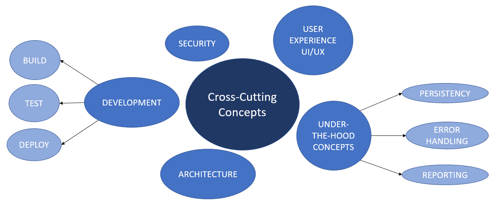

[[section-concepts]]
== Cross-cutting Concepts
This section describes the approaches relevants in multiple parts of our system. 

=== Concepts Mind Map

=== Concepts Detailed

==== UI/UX
The user interface is written with React, it might be in English, and is the design of the app. For user experience is very important. We want the user to use it easily, and comfortably, without any problem.

==== Patterns
The decentralized routes management system follows de MVC (ModelViewController) architecture pattern.

==== "Under-the-hood" Concepts
* Persistency: data is always persistent in every user's pod.
* Exception and error handling: The main error not controlled by the app is having a not stable internet connection as it could damage the app’s correct functioning.
* Reporting: we will use a system to compute changes and code coverall (maybe Travis).

==== Development concepts
* Build: to build our app we will use NodeJS webpack
* Test: we will use some frameworks to try our app. Some of them could be mocha or cucumber.js
* Deploy: Our app will be deployed using Docker.

[role="arc42help"]
****
.Content
This section describes overall, principal regulations and solution ideas that are
relevant in multiple parts (= cross-cutting) of your system.
Such concepts are often related to multiple building blocks.
They can include many different topics, such as

* domain models
* architecture patterns or design patterns
* rules for using specific technology
* principal, often technical decisions of overall decisions
* implementation rules

.Motivation
Concepts form the basis for _conceptual integrity_ (consistency, homogeneity)
of the architecture. Thus, they are an important contribution to achieve inner qualities of your system.

Some of these concepts cannot be assigned to individual building blocks
(e.g. security or safety). This is the place in the template that we provided for a
cohesive specification of such concepts.

.Form
The form can be varied:

* concept papers with any kind of structure
* cross-cutting model excerpts or scenarios using notations of the architecture views
* sample implementations, especially for technical concepts
* reference to typical usage of standard frameworks (e.g. using Hibernate for object/relational mapping)

.Structure
A potential (but not mandatory) structure for this section could be:

* Domain concepts
* User Experience concepts (UX)
* Safety and security concepts
* Architecture and design patterns
* "Under-the-hood"
* Development concepts
* Operational concepts

Note: it might be difficult to assign individual concepts to one specific topic
on this list.

image:images/08-Crosscutting-Concepts-Structure-EN.png["Possible topics for crosscutting concepts"]
****

=== _<Concept 1>_

_<explanation>_

=== _<Concept 2>_

_<explanation>_

...

=== _<Concept n>_

_<explanation>_
